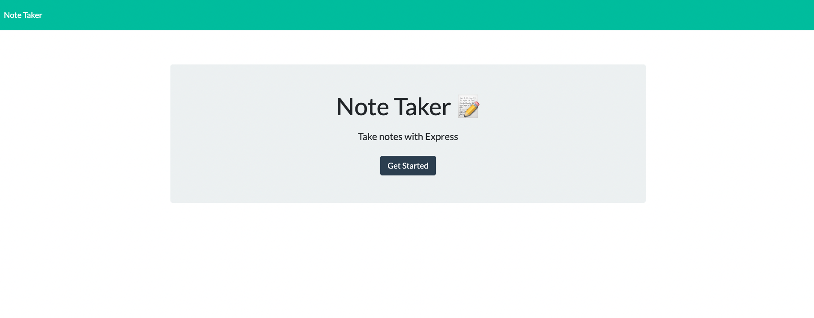

# Note Taker 📔
- Took an existing Front End application 
- Connected it to an `ExpressJS` Back End 
- That can `save` and `retrieve` data from a `JSON` file

## Deployed Heroku Link 🔗
* [Take Notes with ExpressJS](https://floating-journey-55233.herokuapp.com/)

## Description 📓
This application uses an ExpressJS Back End that saves and retrieves note data from a JSON file.
The application’s Front End was already created. My job was to build the Back End, connect the two, 
and then deploy the entire application to Heroku.

